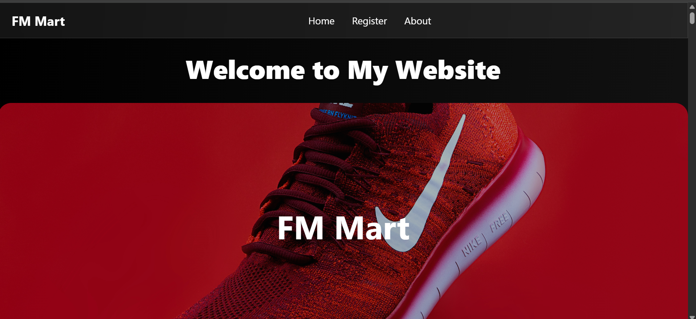

# FM-Mart
 <h2>About Project</h2>

FM-Mart is a full-featured e-commerce platform with user authentication,product
    management,cart system,secure checkout,and order tracking.

 <h2>Key Features</h2>
<ul>
    <li>User Authentication (login/Register)</li>
    <li>Product Management(CRUD)</li>
    <li>Shopping Cart</li>
    <li>Secure Checkout</li>
    <li>Order Tracking and History</li>
    <li> Responsive Desingn</li>

</ul> 
<h2>Tech Stack</h2>
<h3>Backend</h3>
<ul>
<li>Python</li>
<li>Django</li>
</ul>

<h3>Frontend</h3>
<ul>
<li>HTML</li>
<li>CSS</li>
<li>JS</li>
</ul>

<h3>
Database
</h3>
<ul><li>PosgreSQL</li></ul>

<h2>
Installation
</h2>
<h3>Clone the repository</h3>

git clone https://github.com/fakhirmasood-dev/FM-Mart 
cd FM-Mart

<h3>Create a Virtual environment</h3>

python -m venv venv 
Activate it:

<h4>Windows</h4>

venv\scripts\activate

<h4>Linux/macOS</h4>

source venv/bin/activate

<h3>Install dependencies</h3>

pip install -r requirements.txt

<h3>Apply migrations</h3>

python manage.py migrate

<h3>Run the development server</h3>

python manage.py runserver 
Open this url in browser http://127.0.0.1:8000/FM-Mart/home

<h3>Environment Variables</h3>

create .env file and provide all environment variables.

<h1>Author</h1>
<h3>Fakhir Masood</h3>

